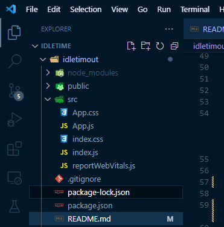

<h1 align="center">How to make an idle timer for your REACT app.</h1>

<em><b>Jump ahead:</b></em>
<br></br>

> <b>Idle Timeout</b>
- <a href="#1">What is an idle Timeout?</a>
- <a href="#2">Why do we need an idle timeout?</a>

> <b>Idle Detection</b>

- <a href="#3">Detecting whether a user is idle.</a>
- <a href="#4">Using React useState and useEffect hooks to determine user inactivity.</a>

<details>
  <summary>
    <a href="#5">Using react-idle-timer package to determine whether a user is idle.</a>
  </summary>
  <ul>
    <li><a href="#6">Creating a custom hook to detect whether the user is idle.</a></li>
    <li><a href="#7">Using our custom hook in our Main app.js.</a></li>

  </ul>
</details>


 
> <b>Handle user activty with the idle feature</b>

- <a href="#8">Creating a modal to prompt user whether to stay or logout.</a>


<h3 id="1">Definition</h3>

<p>An idle timeout is a feature implemented in most web applications for user activity detection. 
  In simple terms, it is used to check whether a user has been inactive(away from the app or computer) for a specified amount of time. 
  Often, an action gets executed after the time of inactivity set is exceeded.
</p>
  
<h3 id="2">Why we need an idle Timeout.</h3>

<p>An idle timout can be used for various purposes like logging a user out of the site if the user is inactive, this is crucial for high risk web apps to enhance security of the application. Logging out a user is also important to improve perfomance of the application by avoiding unnecesarry API calls on the site since the user is inactive. Setting an idle timeout is also a great user experience practice because many at times a user might forget the reason for accessing the site, logging the user out can help in refreshing the user's memory. Many times instead of directly logging a user out of your application you may want to prompt the user on the next action to be taken, whether to log out or continue using the site.</p>


<p>An example use case is when you're watching a long series on Netflix, Netflix might ask you if you are still there and you are given an option of cancelling or continuing the series. In this article we're going to learn how to implement an idle timeout in your React applications by checking if the user is idle or not and asking them whether they want to stay logged in or logout of the site.</p>


<h3 id="3">How to detect if a user is idle in your application</h3>

<p>We first need to detect whether a user is active or not. You can easily have activity detection in your application by installing the <a>react-idle-timer</a> package, but it is important to know some of the functionality the package uses under the hood to make it happen. We will first write the functionality using state that detects the user's active state using some DOM events.
</p>

> <p id="4">Using React's useState and useEffect hooks</p>

<p>Assuming you have already initialized a react app using <code>create-react-app</code>. You should have a folder structure similar to this.</p>

 <p>Inside the <code>App.js</code> file, we can write a script that console logs "The user is inactive" if a user does not perform any of the eventListeners on the application's window and display's a simple text on the UI that check's the state of active whether true or false</p>


```jsx
  //import the required useEffect and useState from React
  import React, {useEffect, useState} from "react"
  
  //Our App component which will be exported as default to our index.js file for rendering.
  const App = ()=> {

    //creating a variable (active) to store our boolean and a function (setActivity) to change our variable's value to either true or false 
    const [active, setActivity] = useState(true)


    
    const checkForInactivity = ()=> {
    
      //Grabs the expired time from the local storage in our browser, store it in a variable called expireTime
      const expireTime = localStorage.getItem("expireTime")
      
      //sets the activity state to false if the expireTime is earlier than the current time
      if (expireTime < Date.now()) {
        console.log("The user is inactive")
        setActivity(false)
      }
    }
    

    const updateExpireTime = ()=> {
      
      //sets the expire timer to 5 seconds after the current date(time to wait to log out the user after detecting inactiviy), you can modify the values
      const expireTime = Date.now() + 5000
      
      //sets the value of the localStorage's expire time
      localStorage.setItem("expireTime", expireTime)
    }
    
    //runs only once when the component is mount
    useEffect( ()=> {
    
      //checks the expire time after every 2 seconds(you can modify the values)
      const interval = setInterval( ()=> {
        checkForInactivity()
      }, 1000)
      
      //clears the interval set
      return ()=> {
        clearInterval(interval)
      }
    }, [])
    
    //runs only once when the component is mount
    useEffect( ()=> {
      //updates the expire time
      updateExpireTime()
      
      //event listensers to detect user activity, click, keypress, scroll, mousemove
      window.addEventListener("click", updateExpireTime)
      window.addEventListener("keypress", updateExpireTime)
      window.addEventListener("scroll", updateExpireTime)
      window.addEventListener("mousemove", updateExpireTime)
      
      //cleansup the event listeners
      return ()=> {
        window.removeEventListener("click", updateExpireTime)
        window.removeEventListener("keypress", updateExpireTime)
        window.removeEventListener("scroll", updateExpireTime)
        window.removeEventListener("mousemove", updateExpireTime)        
      }

    }, [])
    
    return (
      //stringifies the value of the active variable to display on the browser
      <div>Active : {active.toString()}</div>
    )
  }
```
<h5>Code explanation</h5>

- The <code>useState()</code> hook creates a variable called active with an initial value of true and a function called setActive which will toggle the active variable to false when the user does not perform any of the eventListeners created after 5 seconds.
- The <code>checkForInactivity()</code> function gets a key called expireTime from the localStorage of our browser which we will create in our <code>updateExpireTime()</code> function, the local storage stores data with no expiration date, you can<a href="https://www.w3schools.com/jsref/prop_win_localstorage.asp"> read more</a> about local storage. After getting the data, it compares the expireTime with your current time of which if the expireTime was earlier than the date it console logs "The user is inactive"
- The <code>updateExpireTime()</code> function creates a new Item called expireTime inside our local storage which is set to your current time added to 5 seconds (you can adjust the time to your desired time), the expireTime is what the script uses to determine the time taken to logout the user if idle.
- The first <code>useEffect()</code> has variable called interval which sets the interval of checking the expired time after every 1 seconds using the <code>setInterval()</code> method. The setInterval takes in <code>checkForInactivity()</code> as it's first argument and the desired time as the second argument(checks after every 1 seconds). It returns a function that clears the interval from the window and stops the interval.
- The second <code>useEffect()</code> hook is where we have the desired eventListeners and takes <code>updateExpireTime()</code> as the function which simply updates the expireTime to refresh if the user is active. It runs only once when the component mounts because we declared an empty dependancy array as it's seconf argument. Some of the events used are **click, scroll, mousemove, keypress**, you may add your desired events to detect user inactivity. It alse cleans up the window by returning a function that removes the eventListeners from the window.

<video width="350" height=""250>
  <source src="./statevid.mp4" type="video/mp4">

</video>

> <p id="5">Using react-idle-timer package</p>

<p>We can ideally use the <a href="https://www.npmjs.com/package/react-idle-timer"><code>react-idle-timer</code></a> package in our application to determine whether a user is idle and create a function which will prompt our user to either log out or stay in the site after some time of inactivity, to achieve this we will also need another package <code>react-modal</code> to have a ready built modal instead of creating ours.</p>

**Step 1:** <b id="6">Creating a custom <code>useIdle</code>hook</b>
<p>We first have to create our own custom hook which will handle our function to be executed when the user is idle and the specified time to detect user inactivity</p>
<p>Inside your <code>src</code> folder, create another folder named <code>hooks</code> and inside it create a file called <code>useIdle.js</code> where we will write our custom hook.</p>

```
$npm install react-idle-timer
```

```jsx
  //imports React's useState() 
  import {useState} from "react"
  //imports useIdleTimer() hook from react-idle-timer
  import { useIdleTimer } from "react-idle-timer"

  //custom hook called useIdle() which will take in onIdle and the idleTime as it's parameters
  function useIdle({onIdle, idleTime=1}){

      //creates a variable isIdle and a function setIdle
      const [ isIdle, setIdle ] = useState()

      //function to set the state of isIdle to true and executes the command passed on to onIdle
      const handleIdle = ()=> {
          console.log("User is idle")
          setIdle(true)
          console.log("Last Active", getLastActiveTime())
          onIdle()
      }

      /**detructuring getLastActiveTime from useIdleTImer
       * sets the timeout to be in seconds and passes the handleIdle function to onIdle
       * returns the parameters getRemainingTime, getLastActiveTime and isIdle to be used
       * */
      const {getLastActiveTime} = useIdleTimer({
          timeout: 1000 * idleTime ,
          onIdle: handleIdle,
          debounce: 500
      })

      return {
          isIdle,
          setIdle
      }


  }

  //exports our useIdle custom hook
  export default useIdle;
```

<h5>Code explanation</h5>

- Inside the hooks folder you need a file starting with the prefix (use) to indicate that it is a custom hook. Then go ahead an create a function called <code>useIdle()</code> which will be our custom hook. The hook extracts onIdle which will take in a function as the value and idleTime which will be used to set the timeout time and is default to 1 seconnd, you can modify the values from the useIdleTimer hook which has other several props.
- Inside our custom hook we used the <code>useState()</code> hook which will store our isIdle variable and setIdle function to show whether the user is idle.
- We also created a <code>handleIdle()</code> function that is supposed to take an action after the <code>isIdle</code> variable is set to true, in this case it calls the <code>onIdle()</code> function to be executed and console logs the last time the user was active using the getLastActiveTime() method destructured from the useIdleTimer hook
- The useIdleTimer is modified by setting the time to be specified in seconds and sets the onIdle method value to execute the handleIdle function created above.
- It finally returns the props that can be destructured in our App.js and used that is the isIdle and setIdle declared from the useState hook. Finally our hook gets exported to be used.

**Step 2:** <b id="7">Importing out custom hook to our <code>App.js</code> file and using it.</b>
<p>After creating our custom hook and exporting it we need to import it to the file we need it in this case the app.js file.</p>

```jsx
  import useIdle  from "./useIdle";


  const App = ()=> {
    const logout = ()=> {
      console.log("User is logged out")
    }
    const {isIdle} = useIdle({onIdle:logout, idleTime:5})
    return (
      <div>
        {isIdle? <p>You were logged out</p> : <p>You are active</p>}
      </div>
    )
  }

  export default App;
```
<h5>Code explanation</h5>


> Handle user activity

**Step 3:** <b id="8">Use a modal to prompt the user whether to logout or continue with the site.</b>
<p>Let us add some functionality to our idle timeout feature by using a modal to determine the next step, the modal will only pop up if the timeout specified reaches which will contain a prompt that asks the user whether to logout or not. This is a good practice in order to avoid logging the user out unnecessarilly out of our application. We will now have to install the <a href="https://www.npmjs.com/package/react-modal#api-docume"><code>react-modal</code></a> package for this functionality.</p>

```
$npm install react-modal
```

```jsx
import { useState } from "react";
import useIdle  from "./useIdle";
import Modal from "react-modal"
Modal.setAppElement("#root")

const App = ()=> {

  const modalOpen= ()=> {
    setModal(true)
    console.log("User is logged out")
  }


  const [openModal, setModal] = useState()
  const {isIdle, setIdle} = useIdle({onIdle:modalOpen, idleTime:5})

  const stay = ()=> {
    setModal(false)
    setIdle(!isIdle)
  }
  const logout = ()=> {
    setModal(false)
  }

  return (
    <div>
      {isIdle? <p>You were logged out</p> : <p>You are active rn</p>}
      <Modal
        style={{
          content: {
            backgroundColor : "gray",
            display : "flex",
            alignItems : "center",
            flexDirection : "column",
            justifyContent  :"space-between",
            width : "200px",
            height : "200px"

          }
        }} 
        isOpen={openModal}>
        <p>You will be logged out soon</p>
        <div>
          <button onClick={logout}>Logout</button>
          <button onClick={stay}>Stay</button>
        </div>


      </Modal>
    </div>
  )
}

export default App;

```


